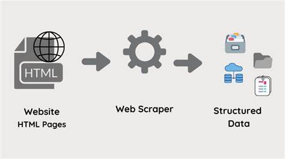

# Web_Scrapping

 

Análisis de datos de Actores Españoles y de los deportistas que mas cobran en los ultimos años.

Visión General

Este repositorio destaca un proyecto de análisis de datos centrado en la extracción y análisis de información relacionada con los actores españoles y de los deportistas que mas cobran en los ultimos años. Diseñado para demostrar habilidades en análisis de datos, este proyecto forma parte de mi portafolio como estudiante de analista de datos.

Descripción del Proyecto

Recopilación de Datos:
Scripts de raspado web en Python utilizan BeautifulSoup y la biblioteca de solicitudes para extraer información clave de páginas web relevantes.

Tratamiento de Datos:
Los datos extraídos se procesan y limpian en Python, creando así un conjunto de datos estructurado para su análisis.

Análisis de Datos:
Se realiza un análisis detallado de los datos para obtener información significativa.

Contenido del Repositorio

(Actores_Españoles.ipynb)y (Deportistas.ipynb): Cuadernos de Jupyter que contiene código para la recopilación, procesamiento y análisis de datos.         

requirements.txt: Lista de bibliotecas y dependencias de Python necesarias.           

data/: Directorio para almacenar datos extraídos.             

README.md: Explicacion breve del proyecto.         

Uso

Instala dependencias: pip install -r requirements.txt
Ejecuta Jupyter Notebook: data_analysis.ipynb
Resultados
Los cuadernos proporcionan información valiosa sobre la demografía y datos biográficos de actores nacidos en España y del ranking de los deportistas mejor pagados en estos ultimos años.

Para preguntas o discusiones adicionales, no dudes en contactarme en iraitzete@gmail.com.
Reconocimientos
Agradezco a BeautifulSoup y la biblioteca de solicitudes por facilitar el proceso de raspado web.
Un agradecimiento especial a IMDb por proporcionar datos valiosos.
Extendido reconocimiento a Demetrio por su guía inspiradora (https://github.com/demstalferez).